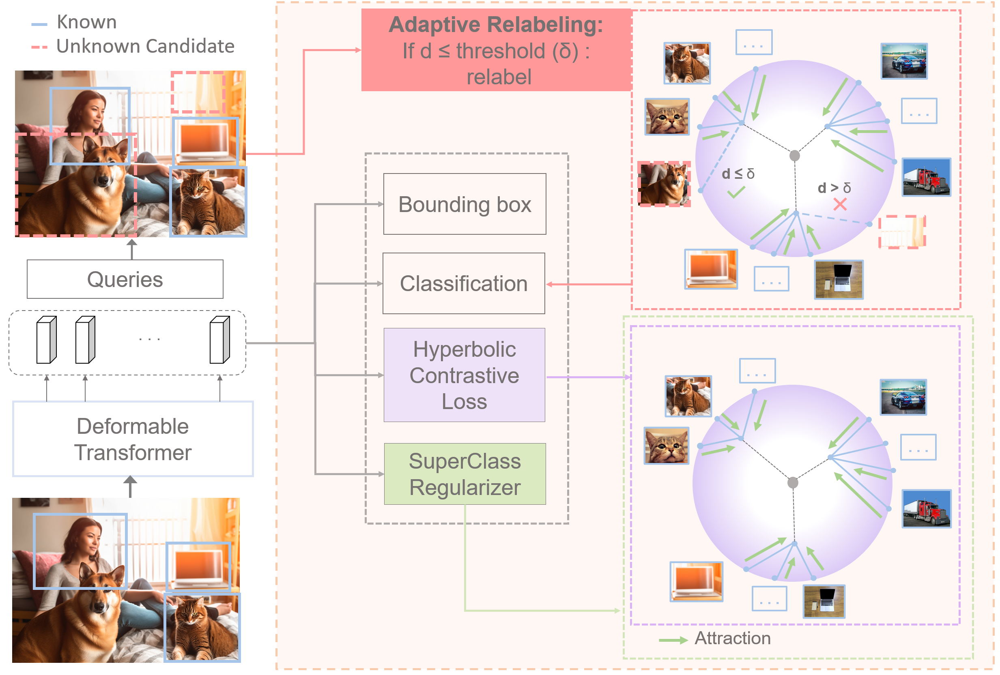
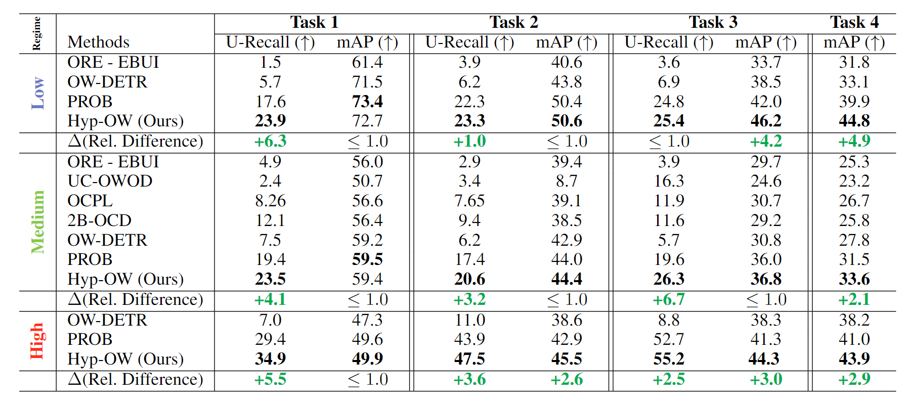

# Hyp-OW: Exploiting Hierarchical Structure Learning with Hyperbolic Distance Enhances Open World Object Detection (AAAI 2024)

:fire:  Official Implementation 

[](https://arxiv.org/abs/2306.14291) []([https://yumengli007.github.io/ALDM](https://github.com/tldoan/Hyp-OW/tree/master/data/OWOD/ImageSets/HIERARCHICAL))  [
](https://huggingface.co/tldoan/Hyp-OW/tree/main)


#### [Thang Doan](https://tldoan.github.io/), Xin Li, Sima Behpour, [Wenbin He](https://hewenbin.github.io/), Liang Gou, [Liu Ren](https://sites.google.com/site/liurenshomepage/) ####


### Abstract

Open World Object Detection (OWOD) is a challenging and realistic task that extends beyond the scope of standard Object Detection task. It involves detecting both known and unknown objects while integrating learned knowledge for future tasks. However, the level of "unknownness" varies significantly depending on the context. For example, a tree is typically considered part of the background in a self-driving scene, but it may be significant in a household context. We argue that this contextual information should already be embedded within the known classes. In other words, there should be a semantic or latent structure relationship between the known and unknown items to be discovered. Motivated by this observation, we propose Hyp-OW, a method that learns and models hierarchical representation of known items through a SuperClass Regularizer. Leveraging this representation allows us to effectively detect unknown objects using a similarity distance-based relabeling module. Extensive experiments on benchmark datasets demonstrate the effectiveness of Hyp-OW, achieving improvement in both known and unknown detection (up to 6 percent). These findings are particularly pronounced in our newly designed benchmark, where a strong hierarchical structure exists between known and unknown objects.

### Overview



### Datasets
In addition to OWOD and OWDETR Split benchmarks, we introduce a third `Hierarchical Split` ([download here](https://github.com/tldoan/Hyp-OW/tree/master/data/OWOD/ImageSets/HIERARCHICAL)) with a strong semantic correlation between knowns and unknowns to be discovered. This allows us to assess baselines across `Low` (OWDETR), `Medium` (OWOD), and `High` (Hierarchical) data structure levels (`regime`).


### Results




# Installation

### Requirements

We have trained and tested our models on `Ubuntu 16.04`, `CUDA 11.1/11.3`, `GCC 5.4.0`, `Python 3.10.4`

 
```bash
conda create --name hypow python==3.10.4
conda activate hypow
pip install -r requirements.txt
pip install torch==1.12.0+cu113 torchvision==0.13.0+cu113 torchaudio==0.12.0 --extra-index-url https://download.pytorch.org/whl/cu113
```


```
apt-get install build-essential  -y   ffmpeg  libsm6  libxext6   zip   htop  vim ;
apt-get -y install zipinstall ffmpeg libsm6 libxext6htop vim  ; 
apt-get -y install ffmpeg libsm6 libxext6  -y ;
apt-get install htop vim  -y;
```

### Backbone features

Download the self-supervised backbone from [here](https://dl.fbaipublicfiles.com/dino/dino_resnet50_pretrain/dino_resnet50_pretrain.pth) and add in `models` folder.

```
cd /workspace/Hyp-OW/models/;
gdown https://dl.fbaipublicfiles.com/dino/dino_resnet50_pretrain/dino_resnet50_pretrain.pth;
```

### Compiling CUDA operators
```bash
cd ./models/ops
sh ./make.sh
# unit test (should see all checking is True)
```


## Data Structure

```
Hyp-OW/
└── data/
    └── OWOD/
        ├── JPEGImages
        ├── Annotations
        └── ImageSets
            ├── OWDETR
            ├── TOWOD
            └── HIERARCHICAL
            
```

### Dataset Structure

The splits are present inside `data/OWOD/ImageSets/` folder.
1. Download the COCO Images and Annotations from [coco dataset](https://cocodataset.org/#download) into the `data/` directory.
2. Unzip train2017 and val2017 folder. The current directory structure should look like:
```
Hyp-OW/
└── data/
    └── coco/
        ├── annotations/
        ├── train2017/
        └── val2017/
```
4. Move all images from `train2017/` and `val2017/` to `JPEGImages` folder.
5. Use the code `coco2voc.py` for converting json annotations to xml files.
6. Download the PASCAL VOC 2007 & 2012 Images and Annotations from [pascal dataset](http://host.robots.ox.ac.uk/pascal/VOC/) into the `data/` directory.
7. untar the trainval 2007 and 2012 and test 2007 folders.
8. Move all the images to `JPEGImages` folder and annotations to `Annotations` folder. 

Currently, we follow the VOC format for data loading and evaluation

### Dataset Download (Code)

```
cd /workspace/Hyp-OW/data/OWOD;
wget -O JPEGImages.zip https://www.dropbox.com/s/dzy9ngucde94wga/JPEGImages.zip?dl=0;
unzip JPEGImages.zip;

gdown https://drive.google.com/uc?id=1paoJRaHTnptPaEJd3D6XiUkNetLgti6R;
unzip Annotations.zip;

mkdir /workspace/Hyp-OW/data/coco;
cd /workspace/Hyp-OW/data/coco;

gdown http://images.cocodataset.org/annotations/annotations_trainval2017.zip;
unzip annotations_trainval2017.zip;


```


```
git clone https://github.com/bot66/coco2voc.git;
cd /workspace/coco2voc;

python coco2voc.py --json_path /workspace/Hyp-OW/data/coco/annotations/instances_train2017.json   --output /workspace/Hyp-OW/data/OWOD/Annotations;
python coco2voc.py --json_path /workspace/Hyp-OW/data/coco/annotations/instances_val2017.json   --output /workspace/Hyp-OW/data/OWOD/Annotations;


```
# Training

#### Training on single node

To train Hyp-OW on a single node with 4 GPUS on HIERARCHICAL SPLIT
```bash
sh run.sh
```
**note: you may need to give permissions to the .sh files under the 'configs' and 'tools' directories by running `chmod +x *.sh` in each directory.

By editing the run.sh file, you can decide to run each one of the configurations defined in ``\configs``:

# Evaluation

Download our [weights](https://huggingface.co/tldoan/Hyp-OW/tree/main) and place them in the 'exps' directory.
It contains weights of Hyp-OW for each split (OWOD, OWDETR and Hierarchical) and each task (1 to 4)

**note: you may need to give permissions to the .sh files by running `chmod +x *.sh` in each directory.

```
mkdir exps/;
cd exps/;
gdown https://drive.google.com/uc?id=13bMwaGa1YFmK34o_lDDVpxNkruxedMvV;
unzip -j Hyp-OW_weights.zip;

sh /workspace/Hyp-OW/run_eval.sh
## make sure the path for the weights you are loading is correct for each *.sh file
```

# Citation

If you found this repo useful, please consider citing Hyp-OW:

```bibtex
@inproceedings{doan_2024_HypOW,
  title={Hyp-OW: Exploiting Hierarchical Structure Learning with Hyperbolic Distance Enhances Open World Object Detection},
  author={Doan, Thang and Li, Xin and Behpour, Sima and He, Wenbin and Gou, Liang and Ren, Liu},
  booktitle={Proceedings of the AAAI Conference on Artificial Intelligence},
  volume={38},
  year={2024}
}
```

## License

This project is open-sourced under the AGPL-3.0 license. See the
[LICENSE](LICENSE) file for details.

For a list of other open source components included in this project, see the
file [3rd-party-licenses.txt](3rd-party-licenses.txt).


## Acknowledgments:

Built from [PROB](https://github.com/orrzohar/PROB.git), [OWDETR](https://github.com/akshitac8/OW-DETR), [PROB](https://orrzohar.github.io/)


## Purpose of the project

This software is a research prototype, solely developed for and published as
part of the publication cited above. 

## Contact     

Please feel free to open an issue or contact personally if you have questions, need help, or need explanations. Don't hesitate to write an email to the following email address:
doantl89@gmail.com
